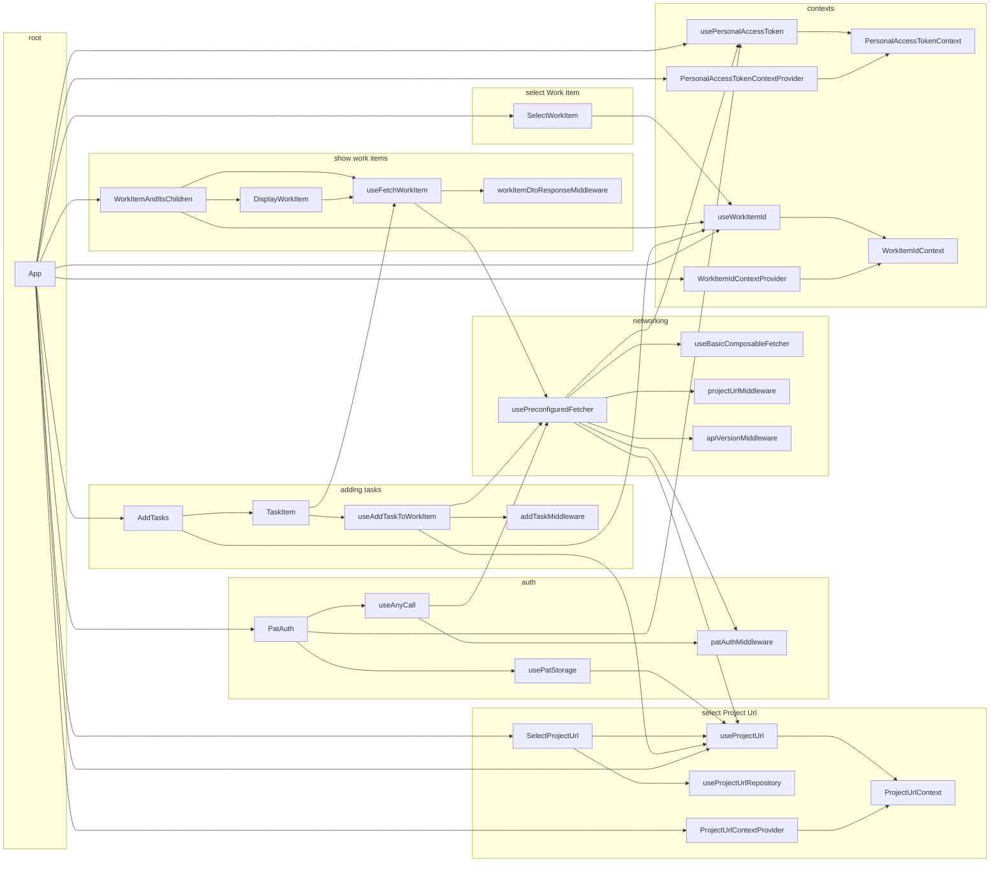
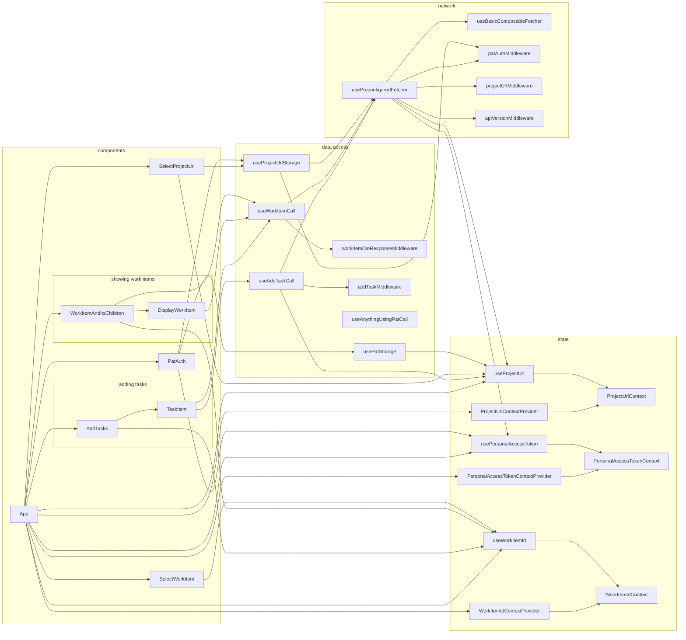
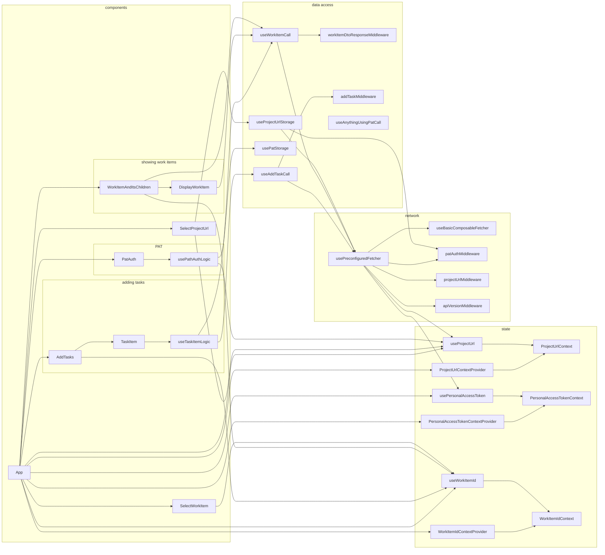

A summary of the first (documented) big changes in the app.

## Before the first global reshuffle

Reorganise project from being grouped by feature to being grouped in layers.

Motivation: some data access functions or state functions were used from multiple 
featurese resulting in a considerable amount of cross-feature dependencies.

Note: some less interesting elements were omitted in the diagrams

## After grouping code into layers rather than features

There are less dependencies between groups.

## After removing dependencies between 'data access' and 'state' layers.

Dependencies look more unidirectional.

